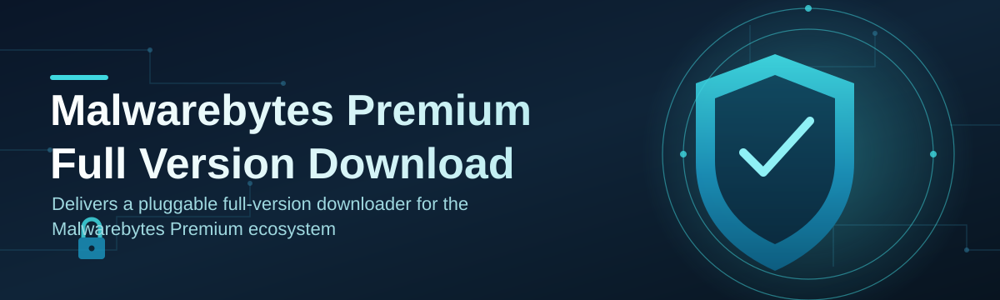
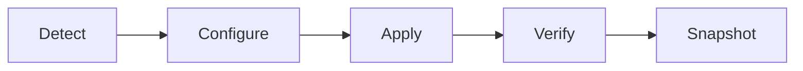

# mb-premium-optimizer 🛡️✨

  

*A tiny companion app that turns a fresh Malwarebytes Premium install into a lean, tuned, silent guardian — in three clicks.*

  

## 🧭 Overview

I built `mb-premium-optimizer` on a weekend because I was tired of the same routine every time I set up Malwarebytes Premium on a new machine: click through six settings menus, disable the noisy notifications, retune scan schedules, fix the tray icon behavior, and hope nothing regressed after the next update. That routine is fine once. It's miserable the tenth time. This project exists so nobody has to do it a tenth time again.

At its core, this is a **post-install configuration and health layer** for Malwarebytes Premium. It doesn't replace the antivirus engine, doesn't touch definitions, and doesn't pretend to be smarter than the real product — it just sits on top and makes the full version download experience feel like it was tuned by someone who actually cares about your CPU fans. Scheduling logic, resource throttling profiles, notification quieting, and a clean dashboard for checking protection status all live here, wrapped in a single portable `.exe`.

This is for the people who install security software and then actually want to *use* their computer afterward — gamers who don't want scan-triggered stutter, laptop users who care about battery drain, and IT folks rolling out Malwarebytes Premium across a small fleet of Windows boxes who need consistent settings without scripting registry edits by hand. If that's you, welcome — this was made for you, genuinely.

> [!NOTE]
> `mb-premium-optimizer` is an independent, community-built companion tool. It configures and monitors an existing Malwarebytes Premium installation — it is not affiliated with or endorsed by Malwarebytes Inc.

  

---

## 🚀 Quick Start

Before the deep dive, here's the whole thing in three steps:

1. **Visit the landing page** and grab the latest build — the button above takes you straight there.

2. **Run the standalone executable.** No installer wizard, no bundled toolbars, no dependency chase.

3. **Click "Optimize"** and let it detect your Malwarebytes Premium install automatically.

That's it. Everything below is context, not prerequisite.

---

## ⚡ What It Actually Fixes

Malwarebytes Premium full version, out of the box, is solid but defaults-heavy. Here's the specific pain each piece of this tool addresses:

- **Scan Scheduler Realism** — the stock scheduler assumes your PC is always on and idle. This module reschedules scans around actual usage patterns instead of arbitrary clock times, so a 2 PM scan never again ambushes you mid-render.

- **Notification Quieting** — protection alerts are important; upsell popups are not. A filtering layer keeps the former and mutes the latter, so your tray stays informative instead of naggy.

- **Resource Throttle Profiles** — three presets (Silent, Balanced, Aggressive) that map directly to CPU/RAM ceilings during active scans, tuned separately for laptops on battery versus desktops on wall power.

- **Definition Freshness Check** — a lightweight watchdog that flags when signature updates have gone stale, before it becomes a real gap in coverage.

- **Startup Footprint Trim** — reorders and delays non-critical background services tied to the Premium suite so boot time doesn't take the hit.

- **Config Snapshot & Restore** — save your tuned settings as a profile file, so a full version download and reinstall on another machine takes seconds to match, instead of manual re-clicking.

- **Real-Time Protection Health Card** — one glanceable panel replacing four separate menus, showing web protection, ransomware shield, and exploit mitigation status in a single glance.

- **Quiet Hours Mode** — define a window (say, 9 PM–7 AM) where scans defer automatically, ideal for shared or always-recording machines.

> [!TIP]
> Start with the **Balanced** throttle profile. Most users switch to Silent within a week once they realize how much headroom their CPU actually has during idle scans.

---

## 🧱 Getting Set Up

<strong>Click to expand the full walkthrough</strong>

1. Head to the landing page (button below) and download the current build for 2026.

2. Save the `.exe` anywhere convenient — Desktop, Downloads, a USB stick, doesn't matter, it's portable.

3. Double-click to launch. On first run it scans your system for an existing Malwarebytes Premium install and links to it automatically.

4. Pick a throttle profile, review the notification filter defaults, and hit **Apply**. Changes take effect immediately, no reboot required.

> [!IMPORTANT]
> A Malwarebytes Premium license needs to already be active on the machine. This tool configures and optimizes the existing full version — it does not generate, activate, or supply licenses of any kind.

---

## 💻 System Requirements

| Component | Minimum |
|---|---|
| OS | Windows 10 (64-bit) or Windows 11 |
| RAM | 4 GB (8 GB recommended for Aggressive profile) |
| Disk | 40 MB free, standalone executable |
| Dependencies | None — no .NET installer, no runtime downloads |
| Admin rights | Recommended for full service-level tuning |

  

---

## ⚙️ How It Works

The internal flow is intentionally simple — detect, read, tune, verify:

1. **Detection** — the app locates the active Malwarebytes Premium installation and reads its current configuration state.

2. **Profile Selection** — you pick a throttle/notification profile (or load a saved snapshot).

3. **Apply Layer** — settings are written through supported configuration channels, never by patching binaries.

4. **Verification Pass** — the health card re-reads protection status to confirm nothing broke in the process.

5. **Snapshot Save** — the resulting config is optionally saved for reuse on other machines.

> [!WARNING]
> Never run this alongside another third-party "optimizer" targeting the same registry paths — conflicting writes can leave both tools reporting inaccurate protection status.

---

## 🧩 Troubleshooting

**Q: The app says it can't detect my Malwarebytes Premium installation — what now?**
A: Confirm the suite is installed and has been launched at least once post-download. First-run initialization creates the config files this tool reads.

**Q: I applied the Aggressive profile and now scans feel slower, not faster — is that normal?**
A: Aggressive maximizes scan speed at the cost of background responsiveness. If your machine is doing other heavy work simultaneously, switch to Balanced instead.

**Q: My protection health card shows a stale definitions warning even after updating.**
A: The check runs on a timer, not instantly. Give it 60 seconds after an update completes, or trigger a manual refresh via the toolbar.

**Q: Will Quiet Hours mode delay a scan indefinitely if I never turn my PC off?**
A: No — deferred scans are capped at 48 hours before they force-run regardless of the quiet window, so protection never lapses silently.

**Q: Can I use this on more than one machine with the same settings?**
A: Yes — export a config snapshot from one install and import it on another. It's the fastest way to standardize a full version download setup across multiple devices.

**Q: Does uninstalling this tool affect Malwarebytes Premium itself?**
A: No. It only removes its own configuration layer; the underlying Premium install and its license remain fully untouched.

---

## 🎨 UI, UX & Personalization

The interface leans minimal on purpose — one main window, no nested settings labyrinth.

- **Themes:** Light, Dark, and an auto mode that follows Windows' system theme.

- **Keyboard shortcuts:**

  | Shortcut | Action |
  |---|---|
  | `Ctrl + O` | Optimize now |
  | `Ctrl + S` | Save current profile snapshot |
  | `Ctrl + R` | Refresh protection health card |
  | `Ctrl + Q` | Toggle Quiet Hours |
  | `F5` | Re-run detection |

- **Settings persistence:** every choice is stored locally in a portable config file next to the executable — nothing phones home, nothing syncs to the cloud.

> [!NOTE]
> Dark mode isn't just cosmetic — it also dims the health card's status colors slightly to reduce eye strain during late-night Quiet Hours monitoring.

---

## 🤝 Contributing & Community

This started as a personal itch-scratch project, and it genuinely means a lot every time someone opens an issue or PR. Contributions are welcome in any shape:

- Bug reports with your Windows build and Malwarebytes Premium version help enormously.

- Feature ideas — especially around new throttle profiles or notification rules — are always up for discussion.

- Pull requests should target a clear, single change; smaller PRs get reviewed faster.

> Found something broken? Open an issue with steps to reproduce. Found something delightful? A star means more than you'd think.

---

## 📜 License

Released under the [MIT License](LICENSE), 2026.

---

## ⚠️ Disclaimer

`mb-premium-optimizer` is an independent, community-maintained utility built to configure and enhance an already-licensed Malwarebytes Premium installation. It is not produced by, affiliated with, or endorsed by Malwarebytes Inc. All trademarks belong to their respective owners. This project does not distribute, generate, or activate any security software licenses — it works exclusively with existing, legitimately installed copies.

  

